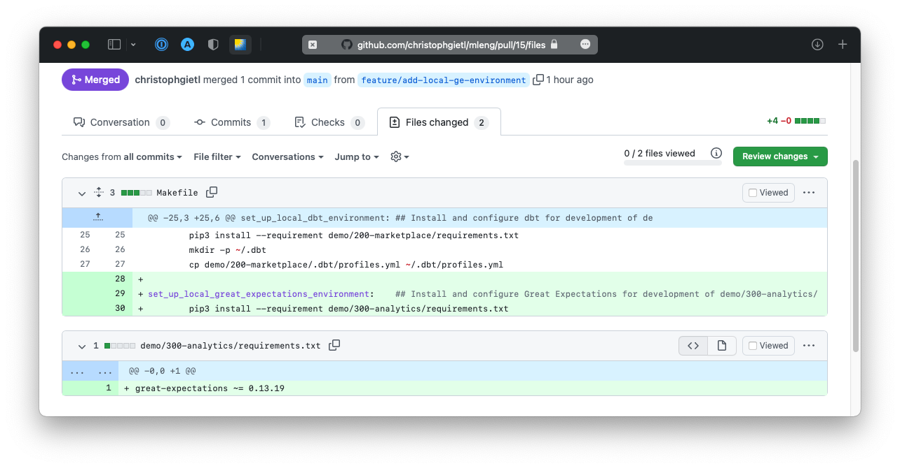

## How can we validate our data?

---

### Why validate data?

> &ldquo;If data replaces code in ML systems,<br/>
> and code should be tested,<br/>
> then [&hellip;] testing of input data is critical<br/>
> to a well functioning system.&rdquo;

<cite style="font-size:0.8em">D. Sculley et al. (2015)</cite>

Note: Explain this quote!

---

### What could possibly go wrong?

- changes in the schema of our data source
    - A column changes its type from integer to string.
    - Unit of `price` changes from 1 USD to 1000 USD.
    - Integer encoding for `condition` changes.
- changes in the real world <!-- .element: class="fragment" -->
    - ZIP code system gets reformed.
    - KC Real Estate Company decides to<br/>allow doghouses on their marketplace.
    - House prices in KC suddenly drop<br/>due to global events.

---

### Demo: adding data validation to our build pipeline

#### Step 1: Install data validation tool

[](https://github.com/christophgietl/mleng/pull/15/files)

---

#### Step 2: Configure tool and create checkpoint

```bash
# Install Great Expectations:
make set_up_local_great_expectations_environment
great_expectations --version

# Configure Great Expectations:
cd demo/300-analytics
great_expectations init # Copy DB credentials from AWS Secrets Manager.

# Explore newly created directory:
cd great_expectations
tree -L 2
bat expectations/kchs.json

# Create new checkpoint:
great_expectations checkpoint new kchs kchs
```

---

#### Step 3: Push checkpoint configuration and add data validation to pipeline

[](https://github.com/christophgietl/mleng/pull/16/commits)

---

#### Step 4: Experiment with build and deployment pipelines in AWS

```bash
git checkout feature/data-validation
make deploy_meta_deployment_stack
```

---

#### Step 5: Use Great Expectations locally

```bash
cd demo/300-analytics/great_expectations/

# Run checkpoint:
great_expectations checkpoint run 20141231

# Explore results in browser:
open uncommitted/data_docs/local_site/index.html
```
