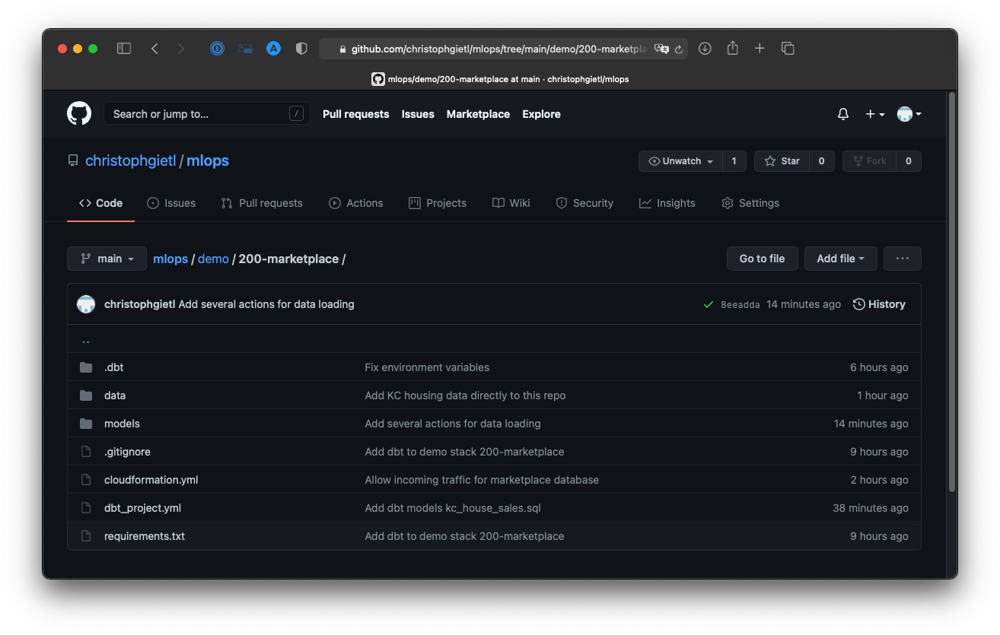
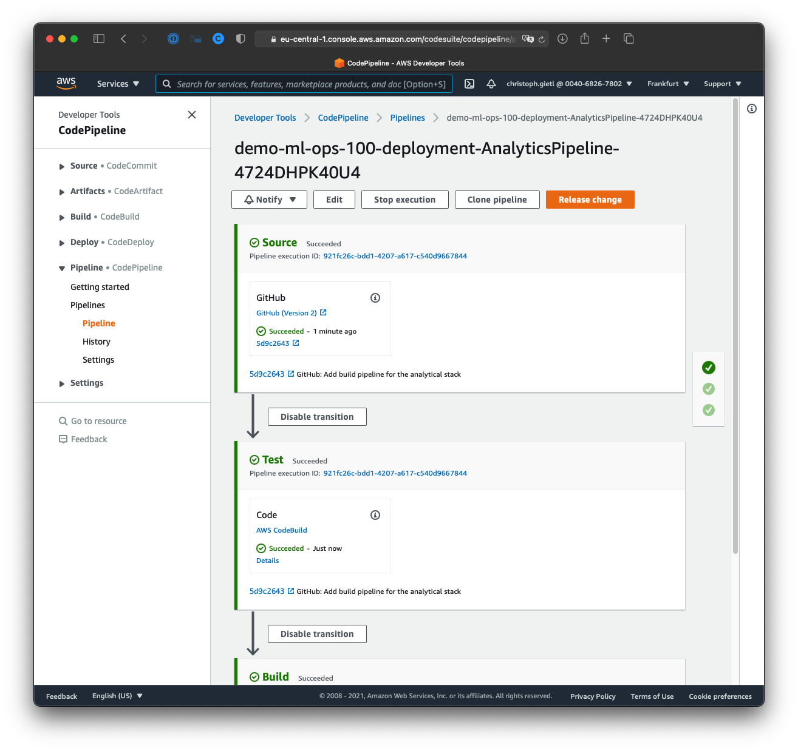

## What have you built so far?

---

### Operational stack of the KC Real Estate Company

- online marketplace for houses in the Seattle area (a.k.a. King County or KC)
- PostgreSQL database containing recent house sales 
  <strong class="fragment" data-fragment-index="2" style="font-size:1.2em; line-height:2em; margin-left:4em">
  ⬆&nbsp;Important for today!&nbsp;⬆
  </strong>

---

#### Demo: house sales data in the database of the KC Real Estate Company

Note:

- GitHub
    - Show database in `demo/200-marketplace/cloudformation.yml`.
    - Show <q>time machine</q> in `demo/200-marketplace/models/kc_house_sales.sql`.
- AWS Management Console
    - Show CodePipeline actions `HouseSales2014` and `HouseSales2014And2015`.
- database client
    - Show query results.

---

### Analytical stack of the KC Real Estate Company

<ul>
    <li>
        <em style="color: #1b91ff; font-style: normal">sales price prediction service</em>
        for houses in KC
        <ul>
            <li>based on
                <ul>
                    <li>data from the database of the marketplace</li>
                    <li>Python technologies (incl. scikit-learn)</li>
                </ul>
            </li>
        </ul>
    </li>
    <li>
        build and deployment pipeline for this service 
        <strong class="fragment" data-fragment-index="1" style="font-size:1.2em; line-height:2em; margin-left:4em">
            ⬆&nbsp;You are here!&nbsp;⬆
        </strong>
</ul>

---

#### Demo: build pipeline for the sales price prediction service

Note:

- AWS Management Console
    - Show actions without details.
