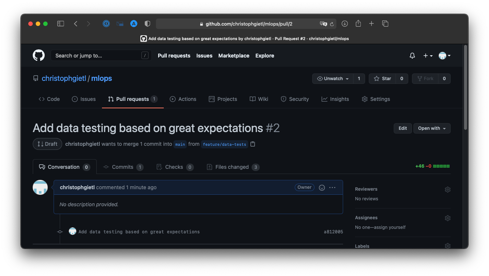

## Testing our data

---

### Why test data?

> &ldquo;If data replaces code in ML systems, 
> and code should be tested, 
> then [&hellip;] testing of input data is critical 
> to a well functioning system.&rdquo;

<cite style="font-size:0.8em">D. Sculley et al. (2015)</cite>

Note: Explain this quote!

---

### What could possibly go wrong?

- changes in the schema of our data source
  - Column changes its type from integer to string.
  - Unit of `price` changes from 1 USD to 1000 USD.
  - Integer encoding for `condition` changes.
- changes in the real world
  - ZIP code system gets reformed.
  - KC Real Estate Company decides to allow doghouses on their marketplace.
  - House prices in KC suddenly drop due to global events.

---

### Demo: adding data tests to our build pipeline

